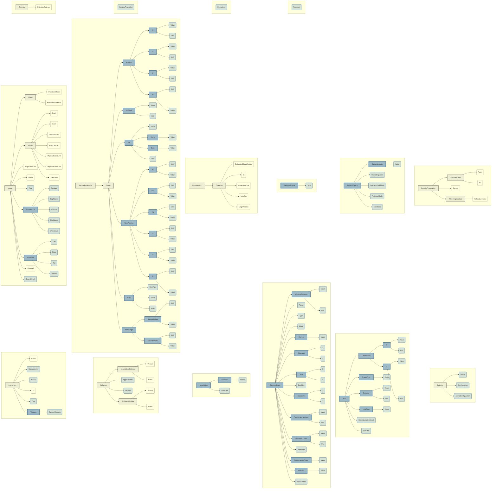

# Model map

One picture of what the converter actually produces: every field a mapping
rule targets, shown under the groups that hold it, with each top-level section
as its own block. <span class="map-key">Blue</span> marks a path the base
model does not have, so the map also shows how much of the converter's output
comes from the electron-microscopy extensions rather than from `schema.json`.

<!-- begin generated map: scripts/gen_model_map.py -->



The **137 fields** some rule in `mappings.json` targets — what the converter can actually fill in — with the groups above them, 184 boxes over 16 sections. Rounded boxes are the targeted fields themselves; square boxes are the groups holding them. <span class="map-key">Blue</span> is a path `schema.json` does not have: 102 of the 137 targets come from the electron-microscopy extensions.

The other fields of the model are not drawn — all 2006 cannot be named in one static picture, and a field no rule targets is not something the converter can produce yet. Use the [model browser](model.md) to see the model in full.

<!-- end generated map -->

## Keeping this page in sync

The map is generated from the packaged mappings and model files, so it cannot
disagree with them. After editing `mappings.json` or a model:

```bash
python scripts/gen_model_map.py
```

`tests/test_model_map.py` fails when the map is stale, so it cannot drift from
the packaged files unnoticed.
