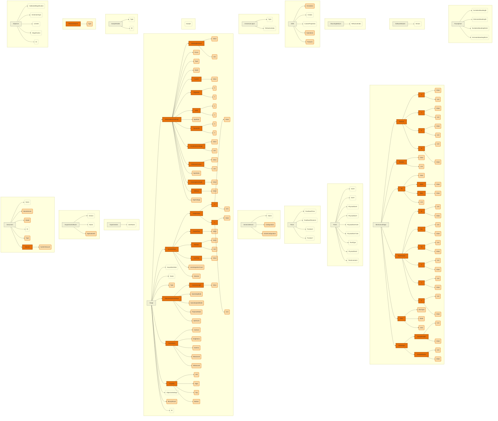

# Model map

One picture of what the converter actually produces: every field a mapping
rule targets, shown under the groups that hold it, with each top-level section
as its own block. <span class="map-key">Orange</span> marks a path LiMi does
not have — one the imaging model adds in `imaging_extension.yaml` or
`imaging_provenance.yaml` — so the map also shows how much of the converter's
output comes from those extensions, mostly electron microscopy, rather than
from LiMi. LiMi's own paths stay a quiet grey.

<div class="map-legend" markdown>
<span><i class="gext"></i> extension group</span>
<span><i class="fext"></i> extension field</span>
<span><i class="gbase"></i> LiMi group</span>
<span><i class="fbase"></i> LiMi field</span>
</div>

A path counts as an extension as soon as it runs through an added class or
slot, so every field under `Image.ElectronBeamSettings` is orange, and so is
`Instrument.Manufacturer`, which LiMi's `Instrument` does not have.

<!-- begin generated map: scripts/gen_model_map.py -->


```mermaid
flowchart LR
classDef gbase fill:#8a8a8a1f,stroke:#80868b,stroke-width:1.5px
classDef fbase fill:none,stroke:#9aa0a6,stroke-width:1px
classDef gext fill:#e8710a,stroke:#a04a00,stroke-width:3px
classDef fext fill:#e8710a40,stroke:#e8710a,stroke-width:2.5px
subgraph s0 [" "]
direction LR
n0["Instrument"]
n1("Name")
n2("Manufacturer")
n3("Model")
n4("ID")
n5("Type")
n6["Vacuum"]
n7("SystemVacuum")
n0-->n1
n0-->n2
n0-->n3
n0-->n4
n0-->n5
n0-->n6
n6-->n7
end
subgraph s1 [" "]
direction LR
n8["AcquisitionSoftware"]
n9("Version")
n10("Name")
n11("ApplicationID")
n8-->n9
n8-->n10
n8-->n11
end
subgraph s2 [" "]
direction LR
n12["Experimenter"]
n13("UserName")
n12-->n13
end
subgraph s3 [" "]
direction LR
n14["Image"]
n15["ElectronBeamSettings"]
n16["WorkingDistance"]
n17("Value")
n18("Unit")
n19("Focus")
n20("Type")
n21("Mode")
n22["Current"]
n23("Value")
n24["Stigmator"]
n25("X")
n26("Y")
n27["Shift"]
n28("X")
n29("Y")
n30("SpotSize")
n31["SourceTilt"]
n32("X")
n33("Y")
n34["AccelerationVoltage"]
n35("Value")
n36("Unit")
n37["EmissionCurrent"]
n38("Value")
n39("Unit")
n40("SpotIndex")
n41["ConvergenceAngle"]
n42("Value")
n43["Defocus"]
n44("Value")
n45("HighVoltage")
n46["ScanSettings"]
n47["FieldOfView"]
n48["X"]
n49("Value")
n50("Unit")
n51["Y"]
n52("Value")
n53("Unit")
n54["FrameTime"]
n55("Value")
n56["Rotation"]
n57("Value")
n58("Unit")
n59["LineTime"]
n60("Value")
n61("LineIntegrationCount")
n62("Detector")
n63("AcquisitionDate")
n64("Name")
n65("Type")
n66["ElectronOpticsSettings"]
n67["CameraLength"]
n68("Value")
n69("OperatingMode")
n70("OperatingSubMode")
n71("ProjectorMode")
n72("Apertures")
n73["Corrections"]
n74("Contrast")
n75("Brightness")
n76("Gamma")
n77("BlackLevel")
n78("WhiteLevel")
n79["CropHint"]
n80("Left")
n81("Right")
n82("Top")
n83("Bottom")
n84("ObjectiveSettings")
n85("BinaryResult")
n86("ID")
n14-->n15
n14-->n46
n14-->n63
n14-->n64
n14-->n65
n14-->n66
n14-->n73
n14-->n79
n14-->n84
n14-->n85
n14-->n86
n15-->n16
n15-->n19
n15-->n20
n15-->n21
n15-->n22
n15-->n24
n15-->n27
n15-->n30
n15-->n31
n15-->n34
n15-->n37
n15-->n40
n15-->n41
n15-->n43
n15-->n45
n16-->n17
n16-->n18
n22-->n23
n24-->n25
n24-->n26
n27-->n28
n27-->n29
n31-->n32
n31-->n33
n34-->n35
n34-->n36
n37-->n38
n37-->n39
n41-->n42
n43-->n44
n46-->n47
n46-->n54
n46-->n56
n46-->n59
n46-->n61
n46-->n62
n47-->n48
n47-->n51
n48-->n49
n48-->n50
n51-->n52
n51-->n53
n54-->n55
n56-->n57
n56-->n58
n59-->n60
n66-->n67
n66-->n69
n66-->n70
n66-->n71
n66-->n72
n67-->n68
n73-->n74
n73-->n75
n73-->n76
n73-->n77
n73-->n78
n79-->n80
n79-->n81
n79-->n82
n79-->n83
end
subgraph s4 [" "]
direction LR
n87["GenericDetector"]
n88("Name")
n89("Configuration")
n90("ActiveConfiguration")
n87-->n88
n87-->n89
n87-->n90
end
subgraph s5 [" "]
direction LR
n91["Plane"]
n92("PixelDwellTime")
n93("PixelDwellTimeUnit")
n94("PositionX")
n95("PositionY")
n91-->n92
n91-->n93
n91-->n94
n91-->n95
end
subgraph s6 [" "]
direction LR
n96["Pixels"]
n97("SizeX")
n98("SizeY")
n99("PhysicalSizeX")
n100("PhysicalSizeY")
n101("PhysicalSizeXUnit")
n102("PhysicalSizeYUnit")
n103("PixelType")
n104("PhysicalSizeZ")
n105("TimeIncrement")
n96-->n97
n96-->n98
n96-->n99
n96-->n100
n96-->n101
n96-->n102
n96-->n103
n96-->n104
n96-->n105
end
subgraph s7 [" "]
direction LR
n106["MechanicalStage"]
n107["Position"]
n108["X"]
n109("Value")
n110("Unit")
n111["Y"]
n112("Value")
n113("Unit")
n114["Z"]
n115("Value")
n116("Unit")
n117["M"]
n118("Unit")
n119("Value")
n120["Rotation"]
n121("Value")
n122("Unit")
n123["Tilt"]
n124("Value")
n125["Alpha"]
n126("Value")
n127["Beta"]
n128("Value")
n129("Unit")
n130["RawPosition"]
n131["M"]
n132("Unit")
n133("Value")
n134["Rot"]
n135("Unit")
n136("Value")
n137["Tilt"]
n138("Unit")
n139("Value")
n140["X"]
n141("Unit")
n142("Value")
n143["Y"]
n144("Unit")
n145("Value")
n146["Z"]
n147("Unit")
n148("Value")
n149["Bias"]
n150("BiasType")
n151("Mode")
n152("Volts")
n153["MultiStage"]
n154["SampleHeight"]
n155("Unit")
n156("Value")
n157["SampleRadius"]
n158("Unit")
n159("Value")
n106-->n107
n106-->n120
n106-->n123
n106-->n130
n106-->n149
n106-->n153
n107-->n108
n107-->n111
n107-->n114
n107-->n117
n108-->n109
n108-->n110
n111-->n112
n111-->n113
n114-->n115
n114-->n116
n117-->n118
n117-->n119
n120-->n121
n120-->n122
n123-->n124
n123-->n125
n123-->n127
n123-->n129
n125-->n126
n127-->n128
n130-->n131
n130-->n134
n130-->n137
n130-->n140
n130-->n143
n130-->n146
n131-->n132
n131-->n133
n134-->n135
n134-->n136
n137-->n138
n137-->n139
n140-->n141
n140-->n142
n143-->n144
n143-->n145
n146-->n147
n146-->n148
n149-->n150
n149-->n151
n149-->n152
n153-->n154
n153-->n157
n154-->n155
n154-->n156
n157-->n158
n157-->n159
end
subgraph s8 [" "]
direction LR
n160["Objective"]
n161("CalibratedMagnification")
n162("ImmersionType")
n163("LensNA")
n164("Magnification")
n165("ID")
n160-->n161
n160-->n162
n160-->n163
n160-->n164
n160-->n165
end
subgraph s9 [" "]
direction LR
n166["ElectronSource"]
n167("Type")
n166-->n167
end
subgraph s10 [" "]
direction LR
n168["SampleHolder"]
n169("Type")
n170("ID")
n168-->n169
n168-->n170
end
subgraph s11 [" "]
direction LR
n171("Sample")
end
subgraph s12 [" "]
direction LR
n172["ImmersionLiquid"]
n173("Type")
n174("RefractiveIndex")
n172-->n173
n172-->n174
end
subgraph s13 [" "]
direction LR
n175["OME"]
n176("Annotation")
n177("Creator")
n178("CustomProperties")
n179("Operations")
n180("Features")
n175-->n176
n175-->n177
n175-->n178
n175-->n179
n175-->n180
end
subgraph s14 [" "]
direction LR
n181["MountingMedium"]
n182("RefractiveIndex")
n181-->n182
end
subgraph s15 [" "]
direction LR
n183["SoftwareModule"]
n184("Version")
n183-->n184
end
subgraph s16 [" "]
direction LR
n185["Fluorophore"]
n186("ExcitationWavelength")
n187("EmissionWavelength")
n188("ExcitationWavelengthUnit")
n189("EmissionWavelengthUnit")
n185-->n186
n185-->n187
n185-->n188
n185-->n189
end
s0~~~s1~~~s2~~~s3~~~s4~~~s5~~~s6~~~s7
s8~~~s9~~~s10~~~s11~~~s12~~~s13~~~s14~~~s15~~~s16
class n0,n8,n12,n14,n87,n91,n96,n106,n160,n168,n172,n175,n181,n183,n185 gbase
class n1,n4,n9,n10,n13,n63,n64,n84,n86,n88,n92,n93,n94,n95,n97,n98,n99,n100,n101,n102,n103,n104,n105,n161,n162,n163,n164,n165,n169,n170,n171,n173,n174,n177,n178,n182,n184,n186,n187,n188,n189 fbase
class n6,n15,n16,n22,n24,n27,n31,n34,n37,n41,n43,n46,n47,n48,n51,n54,n56,n59,n66,n67,n73,n79,n107,n108,n111,n114,n117,n120,n123,n125,n127,n130,n131,n134,n137,n140,n143,n146,n149,n153,n154,n157,n166 gext
class n2,n3,n5,n7,n11,n17,n18,n19,n20,n21,n23,n25,n26,n28,n29,n30,n32,n33,n35,n36,n38,n39,n40,n42,n44,n45,n49,n50,n52,n53,n55,n57,n58,n60,n61,n62,n65,n68,n69,n70,n71,n72,n74,n75,n76,n77,n78,n80,n81,n82,n83,n85,n89,n90,n109,n110,n112,n113,n115,n116,n118,n119,n121,n122,n124,n126,n128,n129,n132,n133,n135,n136,n138,n139,n141,n142,n144,n145,n147,n148,n150,n151,n152,n155,n156,n158,n159,n167,n176,n179,n180 fext
```

The **146 fields** some rule in `mappings.json` targets — what the converter can actually fill in — with the groups above them, 190 boxes over 17 sections. Rounded boxes are the targeted fields themselves; square boxes are the groups holding them. <span class="map-key">Orange</span> is a path LiMi does not have: 97 of the 146 targets come from the extensions, mostly electron microscopy.

The other fields of the model are not drawn — all 3713 cannot be named in one static picture, and a field no rule targets is not something the converter can produce yet. Use the [model browser](model.md) to see the model in full.

<!-- end generated map -->

## Keeping this page in sync

The map is generated from the packaged mappings and model files, so it cannot
disagree with them. After editing `mappings.json` or the model:

```bash
python scripts/gen_model_map.py
```

`tests/test_model_map.py` fails when the map is stale, so it cannot drift from
the packaged files unnoticed.
