# The metadata model

The model is the target of every conversion: each of its leaves is one field of
the output dict, named by its dotted path (`Image.Pixels.SizeX`,
`Instrument.Vacuum.GunVacuum`). The browser below reads the packaged model
files directly, so it always shows what the installed version actually maps to.

## Browse the model

<div data-model-tree
     data-base="../data/schema.json"
     data-extended="../data/schema.extended.json"
     data-mappings="../data/mappings.json">
</div>

How to use it:

- **Extended model / Base model** switches between
  `schema.extended.json` — the model used for conversion — and `schema.json`,
  the base model on its own.
- **Filter** matches anywhere in the dotted path, so `Pixels.Size` finds the
  five size fields and `Unit` finds every unit field in the model.
- **Extensions only** narrows the extended model to the fields it adds on top
  of the base model — the electron-microscopy sections and the extra fields
  scattered through the shared ones.
- **Mapped only** shows the fields some rule in `mappings.json` targets.
  Hover the badge to see which source paths reach that field.
- Clicking a field name copies its dotted path, ready to paste as the
  right-hand side of a mapping rule.
- A path in the URL fragment opens and highlights that field, so
  [`#Image.Pixels.PhysicalSizeX`](#Image.Pixels.PhysicalSizeX) is a shareable
  link to one field.

An unbadged field is one no mapping rule targets yet. That is not a gap in the
model — it is a field awaiting a source that provides it.

## Where each element comes from

One view of the model's top level, coloured by origin: the base model in
black, and what the extended model adds in blue - both the sections that
exist only in the extended model and the groups it adds inside sections the
base model already has. Sections are labelled with the number of fields
below them.

```mermaid
flowchart LR
  classDef base fill:none,stroke:#6b6b6b,stroke-width:1px
  classDef ext fill:#4a7fb522,stroke:#4a7fb5,stroke-width:2px

  model["metadata model"]:::base

  model --> Instrument["Instrument<br/>3 fields"]:::base
  Instrument --> Instrument_Manufacturer["Manufacturer<br/>string"]:::ext
  Instrument --> Instrument_Model["Model<br/>string"]:::ext
  Instrument --> Instrument_Type["Type<br/>string"]:::ext
  Instrument --> Instrument_ComputerName["ComputerName<br/>string"]:::ext
  Instrument --> Instrument_Vacuum["Vacuum<br/>5 fields"]:::ext

  model --> Image["Image<br/>56 fields"]:::base
  Image --> Image_Type["Type<br/>string"]:::ext
  Image --> Image_CropHint["CropHint<br/>4 fields"]:::ext
  Image --> Image_Corrections["Corrections<br/>5 fields"]:::ext
  Image --> Image_BinaryResult["BinaryResult<br/>object"]:::ext

  model --> Settings["Settings<br/>81 fields"]:::base

  model --> OpticsHolder["OpticsHolder<br/>109 fields"]:::base

  model --> ChildElement["ChildElement<br/>53 fields"]:::base

  model --> MicroscopeStand["MicroscopeStand<br/>22 fields"]:::base

  model --> Transmitted_LightSource["Transmitted_LightSource<br/>38 fields"]:::base

  model --> Fluorescence_LightSource["Fluorescence_LightSource<br/>96 fields"]:::base

  model --> OpticalAssembly["OpticalAssembly<br/>65 fields"]:::base

  model --> Software["Software<br/>28 fields"]:::base
  Software --> Software_ApplicationID["ApplicationID<br/>string"]:::ext
  Software --> Software_Version["Version<br/>string"]:::ext

  model --> SamplePreparation["SamplePreparation<br/>73 fields"]:::base

  model --> MicroscopyAccessories["MicroscopyAccessories<br/>37 fields"]:::base

  model --> Magnification["Magnification<br/>33 fields"]:::base

  model --> Aperture["Aperture<br/>86 fields"]:::base

  model --> Detector["Detector<br/>300 fields"]:::base
  Detector --> Detector_Name["Name<br/>string"]:::ext
  Detector --> Detector_Type["Type<br/>string"]:::ext
  Detector --> Detector_Gain["Gain<br/>number"]:::ext
  Detector --> Detector_Offset["Offset<br/>number"]:::ext
  Detector --> Detector_Brightness["Brightness<br/>number"]:::ext
  Detector --> Detector_Contrast["Contrast<br/>number"]:::ext
  Detector --> Detector_Channel["Channel<br/>integer"]:::ext
  Detector --> Detector_Configuration["Configuration<br/>array"]:::ext
  Detector --> Detector_ActiveConfiguration["ActiveConfiguration<br/>object"]:::ext

  model --> SamplePositioning["SamplePositioning<br/>194 fields"]:::base

  model --> Lens["Lens<br/>272 fields"]:::base

  model --> AdditionalOptics["AdditionalOptics<br/>47 fields"]:::base

  model --> LightSourceCoupling["LightSourceCoupling<br/>36 fields"]:::base

  model --> FluorescenceLightPath["FluorescenceLightPath<br/>93 fields"]:::base

  model --> SampleConditions["SampleConditions<br/>8 fields"]:::base

  model --> MirroringDevice["MirroringDevice<br/>77 fields"]:::base

  model --> Filter["Filter<br/>48 fields"]:::base

  model --> LightPath["LightPath<br/>9 fields"]:::base

  model --> CalibrationTools["CalibrationTools<br/>12 fields"]:::base

  model --> ElectronSource["ElectronSource<br/>1 field"]:::ext
  ElectronSource --> ElectronSource_Type["Type<br/>string"]:::ext

  model --> ElectronBeam["ElectronBeam<br/>39 fields"]:::ext
  ElectronBeam --> ElectronBeam_Type["Type<br/>string"]:::ext
  ElectronBeam --> ElectronBeam_Mode["Mode<br/>string"]:::ext
  ElectronBeam --> ElectronBeam_Focus["Focus<br/>number"]:::ext
  ElectronBeam --> ElectronBeam_SpotSize["SpotSize<br/>number"]:::ext
  ElectronBeam --> ElectronBeam_SpotIndex["SpotIndex<br/>integer"]:::ext
  ElectronBeam --> ElectronBeam_WorkingDistance["WorkingDistance<br/>2 fields"]:::ext
  ElectronBeam --> ElectronBeam_AccelerationVoltage["AccelerationVoltage<br/>2 fields"]:::ext
  ElectronBeam --> ElectronBeam_Current["Current<br/>2 fields"]:::ext
  ElectronBeam --> ElectronBeam_EmissionCurrent["EmissionCurrent<br/>2 fields"]:::ext
  ElectronBeam --> ElectronBeam_ConvergenceAngle["ConvergenceAngle<br/>2 fields"]:::ext
  ElectronBeam --> ElectronBeam_Defocus["Defocus<br/>2 fields"]:::ext
  ElectronBeam --> ElectronBeam_Shift["Shift<br/>2 fields"]:::ext
  ElectronBeam --> ElectronBeam_SourceTilt["SourceTilt<br/>2 fields"]:::ext
  ElectronBeam --> ElectronBeam_Stigmator["Stigmator<br/>2 fields"]:::ext
  ElectronBeam --> ElectronBeam_HighVoltage["HighVoltage<br/>16 fields"]:::ext

  model --> ElectronOptics["ElectronOptics<br/>7 fields"]:::ext
  ElectronOptics --> ElectronOptics_CameraLength["CameraLength<br/>2 fields"]:::ext
  ElectronOptics --> ElectronOptics_OperatingMode["OperatingMode<br/>string"]:::ext
  ElectronOptics --> ElectronOptics_OperatingSubMode["OperatingSubMode<br/>string"]:::ext
  ElectronOptics --> ElectronOptics_ProjectorMode["ProjectorMode<br/>string"]:::ext
  ElectronOptics --> ElectronOptics_GunLensSetting["GunLensSetting<br/>string"]:::ext
  ElectronOptics --> ElectronOptics_Apertures["Apertures<br/>array"]:::ext

  model --> Scan["Scan<br/>12 fields"]:::ext
  Scan --> Scan_FieldOfView["FieldOfView<br/>4 fields"]:::ext
  Scan --> Scan_Rotation["Rotation<br/>2 fields"]:::ext
  Scan --> Scan_FrameTime["FrameTime<br/>2 fields"]:::ext
  Scan --> Scan_LineTime["LineTime<br/>2 fields"]:::ext
  Scan --> Scan_LineIntegrationCount["LineIntegrationCount<br/>integer"]:::ext
  Scan --> Scan_Detector["Detector<br/>string"]:::ext

  model --> Acquisition["Acquisition<br/>2 fields"]:::ext
  Acquisition --> Acquisition_Operator["Operator<br/>1 field"]:::ext
  Acquisition --> Acquisition_StartDate["StartDate<br/>string"]:::ext

  model --> CustomProperties["CustomProperties<br/>object"]:::ext

  model --> Operations["Operations<br/>object"]:::ext

  model --> Features["Features<br/>object"]:::ext

```

<!-- begin generated diagram: scripts/gen_model_diagram.py -->



**Black** &mdash; `schema.json`, the base model: 25 sections, 1876 fields. <span style="color:#4a7fb5"><strong>Blue</strong></span> &mdash; what `schema.extended.json` adds: 8 electron-microscopy sections and 130 fields, including the groups it adds inside sections the base model already has.

<!-- end generated diagram -->

## How the two models relate

| File | Fields | Contents |
| --- | --- | --- |
| `schema.json` | 1876 | the base model, 25 top-level sections from `Instrument` to `CalibrationTools` |
| `schema.extended.json` | 2006 | the base model plus the electron-microscopy extensions: `ElectronSource`, `ElectronBeam`, `ElectronOptics`, `Scan`, `Acquisition`, `Operations`, `Features` and `CustomProperties` |

`AcquisitionMetadataMapper` loads `schema.extended.json` unless you pass
`schema_file`, and uses it twice: as the set of valid mapping targets, and as
the suffix-matched fallback for source paths no rule names.

## Reading a leaf

Every leaf is a `"FieldName": "type"` pair — there is no `properties` level and
no `$schema`. The type is one of the six JSON type names shown as a badge in
the tree:

| Badge | Meaning |
| --- | --- |
| `string` | text |
| `number` | any numeric value |
| `integer` | whole number |
| `boolean` | true / false |
| `array` | a list of records, what a `"Target[]"` mapping rule fills |
| `object` | a nested structure the model does not break down further |

The types are descriptive, not enforced: the mapper matches on paths only, and
never validates or coerces a value against its declared type.

## Keeping this page in sync

The browser fetches its copies from `docs/data/`, which
`scripts/sync_docs_data.py` mirrors from
`src/imaging_metadata_converter/data/`. After editing a model or the mappings:

```bash
python scripts/sync_docs_data.py
```

`tests/test_docs_data.py` fails when those copies are stale, so the docs cannot
drift from the packaged files unnoticed.
